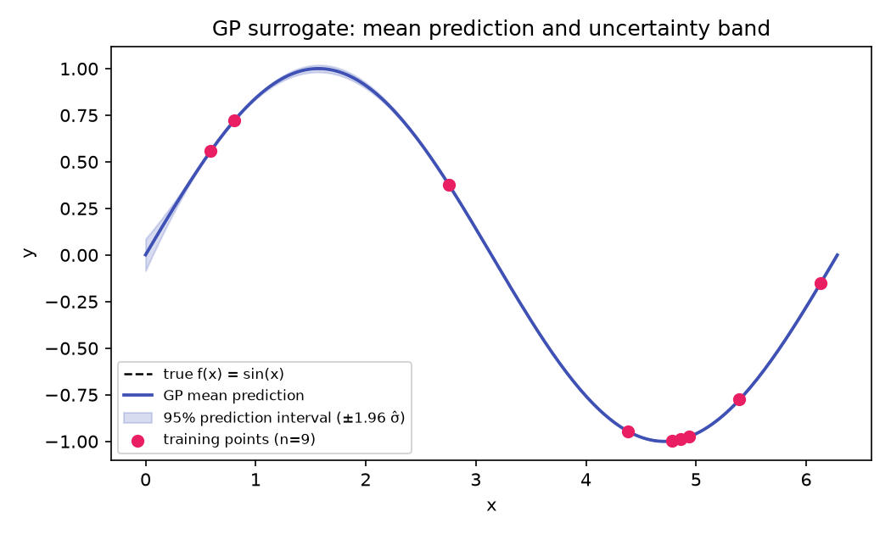

# itis-sumo

Running complex simulations across design spaces is slow and expensive, but itis-sumo lets you train a fast surrogate model that captures the simulation's behavior—enabling you to sweep parameters, optimize designs, and quantify sensitivity with honest uncertainty bars. It provides uncertainty quantification (Sobol' indices, propagation), sampling strategies (LHS, grid, manual-UQ), MOGA optimization, and tools to build, cross-validate, and interrogate your surrogate models, all as an importable Python package.

**Scope:** itis-sumo is a headless computational core with no Flask, oSPARC, or web-UI dependency. For the web UI, see the separate [`mmux_documentation`](https://github.com/ITISFoundation/mmux_documentation) site.

**New to itis-sumo?** Start with the [Getting started](tutorials/getting-started.md) guide to install, verify the engine, and build your first surrogate.

## Where to go

- **New here?** [Getting started](tutorials/getting-started.md) — build,
  cross-validate, and interrogate one surrogate end to end, real runnable
  code throughout.
- **Need to do something specific?** How-to guides —
  task recipes for [cross-validation](how-to/cross-validate.md), [sensitivity/UQ](how-to/sensitivity-analysis.md), [MOGA optimization](how-to/moga.md), and
  [data preprocessing](how-to/preprocess.md).
- **Want the why, not just the how?** Why [surrogate modeling](explanation/surrogate-modeling.md) and how [Gaussian Processes](explanation/gaussian-processes.md) work — worked examples included.
- **Want proof it actually works?** [Worked examples](tutorials/examples.md) — real Dakota fits validated against closed-form analytical solutions, with figures.
- **Looking up an exact function signature?** [Reference](reference/index.md) —
  module-by-module API and the design invariants behind it.
- **Curious about the engine pin, fork provenance, or how this fits into
  MMUX?** [About](about/index.md).

Evidence the pipeline reproduces known analytical solutions, not just
"didn't crash": [Verification & Validation report](verification-validation.md).
