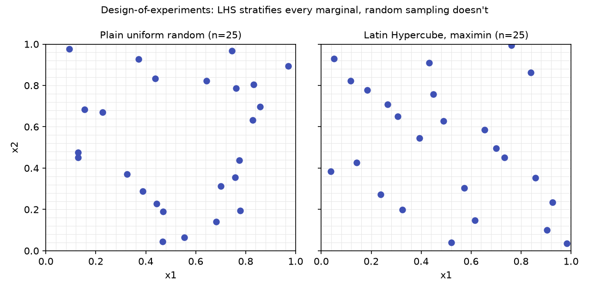
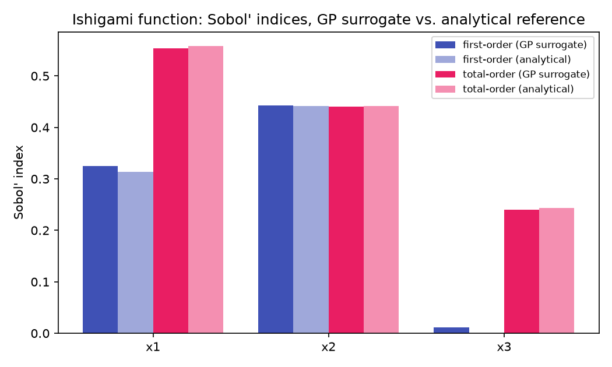

# Worked examples

Every figure on this page is generated by
[`examples/generate_docs_figures.py`](https://github.com/ITISFoundation/itis-sumo/blob/main/examples/generate_docs_figures.py)
against itis-sumo's real public API — a real (unmocked) Dakota GP fit, the
real LHS sampler, the real Sobol' pipeline — on small analytical problems
chosen because the right answer is known in closed form. Regenerate them
yourself with:

```bash
uv run --group docs python examples/generate_docs_figures.py
```

For the real-application examples referenced in the roadmap below (NIH
in-silico model, and datasets from Paria, Giuliana, Luisa), see the
[Provenance / Porting](../about/porting.md) page and the corresponding Project House
tasks — those write-ups will be added here as they land.

## 1. A GP surrogate fit, with its own uncertainty

[Theory: how Gaussian Processes work](../explanation/gaussian-processes.md) covers the math;
here is the actual shape of it. Nine training points sampled from
\(f(x) = \sin(x)\) on \([0, 2\pi]\), fit through itis-sumo's real
`evaluate_sumo`, evaluated on a dense grid:

```python
from itis_sumo.evaluate.funs_evaluate import evaluate_sumo

# x_train: 9 points, y_train = sin(x_train), written as a Dakota training file
result = evaluate_sumo(run_dir, train_file, eval_file, ["x"], "y")
y_hat = result["y_hat"]        # posterior mean, μ(x)
y_std = result["y_std_hat"]    # posterior std, σ(x) — V8df in SPEC.md
```


Notice the band pinches to (near) zero width right at each training point and
widens between them — that's the posterior variance formula
\(\sigma^2(\mathbf{x}_*) = k(\mathbf{x}_*,\mathbf{x}_*) - \mathbf{k}_*^\top (K+\sigma_n^2 I)^{-1}\mathbf{k}_*\)
from the [GP theory page](../explanation/gaussian-processes.md#fitting-prior-posterior-conditioned-on-training-data)
made visible: query points near training data have large kernel similarity to
something already observed (small subtracted term, small variance); query
points far from all training data don't (large variance). This is the same
mechanism the test suite checks numerically in
`test_variance_near_zero_at_training_points_grows_away`.

## 2. Why Latin Hypercube sampling, not plain random

[Sampling theory](../explanation/surrogate-modeling.md#what-makes-a-function-a-good-or-bad-surrogate-target)
argues that training-point placement matters as much as training-point count.
25 points each, drawn two ways, using itis-sumo's real `lhs()`:

```python
from itis_sumo.sampling.lhs import lhs

lhs_pts = lhs(2, 25, method="maximin", seed=42)   # stratified: one draw per 1/25 bin, per axis
rand_pts = rng.uniform(0.0, 1.0, size=(25, 2))     # i.i.d. uniform — no stratification guarantee
```



The random draw (left) visibly clusters in some regions and leaves gaps in
others — pure chance, but chance that wastes training budget where two points
land close together and tell the surrogate almost nothing it didn't already
know. LHS (right) guarantees each of the 25 equal-width bins along **both**
`x1` and `x2` contains exactly one point — every training run is guaranteed
even 1D marginal coverage, which is what the seeded-RNG invariant `V3er` in
[SPEC.md](../about/spec.md) exists to make reproducible.

## 3. Sensitivity analysis on a surrogate: does it recover the right physics?

The Ishigami function is the standard analytical test case for sensitivity
methods because its Sobol' indices are known in closed form — see
[Reference → Sensitivity (Sobol) & UQ](../reference/sensitivity-uq.md#validation-ishigami-analytical-acceptance-gate)
for the derivation. This is *not* the pure-math validation already covered
there (which bypasses the surrogate entirely) — this trains a real GP on 300
noisy-free samples of the Ishigami function and runs the full
`evaluate_sobol_indices` pipeline, surrogate included:

```python
sobol = evaluate_sobol_indices(
    run_dir, train_file, ["x1", "x2", "x3"], "y1", distributions, preprocessor, seed=42
)["sobol"]
```



The GP-surrogate-derived indices (dark bars) track the analytical reference
(light bars) closely for all three variables and both index orders — including
correctly recovering that `x3` has **zero first-order effect** despite having a
**large total-order effect** (\(S_3 \approx 0\), \(S_{T3} \approx 0.244\)),
which is only possible because of Ishigami's `x1`–`x3` interaction term. A
surrogate that got the interaction structure wrong would show up here as a
`x3` total-order bar collapsing toward its (near-zero) first-order bar. This is
the sensitivity-analysis analogue of the GP-fit sanity check above: trust in
the downstream analysis is only as good as the surrogate it's built on, and
this is what it looks like when that trust is earned rather than assumed.

## Real-application examples (in progress)

The three worked examples above are analytical sanity checks — closed-form
answers, no ambiguity about whether the surrogate got it "right." The next
phase of validation work is running itis-sumo against **real, previously
unseen application data**, where there's no closed-form answer to check
against and the real question is whether the surrogate + UQ + sensitivity
pipeline gives trustworthy, decision-useful answers on a genuine research
problem. Four such applications are tracked as Project House tasks:

1. **NIH in-silico model** — prioritized first.
2. Real bioelectronic/simulation datasets contributed by **Paria**, **Giuliana**,
   and **Luisa**.

Each will be written up here as a dedicated example page once the underlying
validation work lands.
